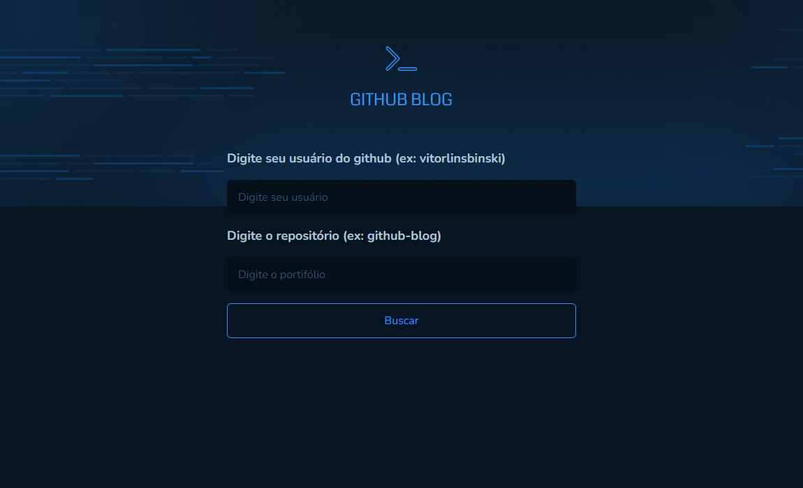

<div align="center">
  
</div>

<h1 align = "center">GitHub Blog</h1>
<p>A blog to check out all of your issues from a repository and profile information from GitHub. This project uses the GitHub API</p>

<div align="center">
  <div style="display: flex; justify-content: space-between; align-items: center;">
    
    
    
    
    
  </div>
</div>

<h4 align="center"> 
	GitHub Blog | Status: Done ✔️
</h4>

## Table of Contents

- [Features](#features)
- [Requirements to run the project](#requirements-to-run-the-project)
- [Running the application](#running-the-application)
- [Main Technologies](#main-technologies)
- [Final Result](#final-result)
  - [Home page](#home-page)
  - [Profile page](#profile-page)
  - [Profile page with issue filter](#profile-page-with-issue-filter)
  - [Issue post page](#issue-post-page)
- [Deploy](#deploy)
- [License](#license)
- [Author](#author)
- [Contributing Guidelines](#contributing-guidelines)

## Features

GitHub Blog is a web application that offers a range of powerful features to help you explore GitHub repositories and user profiles efficiently. Here are the key features:

### 1. Search for Issues in a Repository

Easily search for issues within any GitHub repository. Whether you're a contributor or a user interested in a project, this feature allows you to find and track specific issues.

### 2. Display GitHub Profile Information

View comprehensive information about GitHub user profiles. This includes followers, profile description, work location and profile image.

### 3. View Issue Posts

Explore and read detailed posts about specific issues within a repository. Access discussions, solutions, and contributions made by the GitHub community.

### 4. User-Friendly Interface

Our user interface is designed for simplicity and usability. Enjoy a seamless experience while navigating through profiles, and issue posts.

### 6. Search Filters

Refine your searches with advanced filters. Narrow down results by labels, tags, date, and more, making it easier to find the information you need.

### 7. Markdown Support

Read and create issue posts in Markdown format. Enjoy rich text formatting options and code highlighting for a better reading experience.

## Requirements to run the project

<p>Before you run the project, check if you have [Node.js](https://nodejs.org/en/) installed on your machine, as well [Git](https://git-scm.com) to clone this repository.</p>

## Running the application

```bash
    # Clone this repository on your machine:
    $ git clone https://github.com/vitorlinsbinski/github-blog.git

    # Access the project folder in your terminal:
    $ cd github-blog

    # Install all dependencies:
    $ npm install

    # Run the application:
    $ npm run dev
```

## Main Technologies

- [ReactJS](https://react.dev/)
- [Vite](https://vitejs.dev/)
- [TypeScript](https://www.typescriptlang.org/)
- [React Hook Form](https://www.react-hook-form.com/)
- [ZOD](https://zod.dev/)
- [React Router DOM](https://reactrouter.com/en/main)
- [Axios](https://axios-http.com/ptbr/docs/intro)
- [Styled Components](https://styled-components.com/)
- [use-context-selector](https://github.com/dai-shi/use-context-selector)
- [date-fns](https://date-fns.org/)
- [react-markdown](https://github.com/remarkjs/react-markdown)
- [react-syntax-highlighter](https://github.com/react-syntax-highlighter/react-syntax-highlighter)

## Final Result

### Home page

<span>/</span>


### Profile page

<span>/vitorlinsbinski/github-blog</span>


### Profile page with issue filter

<span>/vitorlinsbinski/github-blog</span>


### Issue post page

<span>/vitorlinsbinski/github-blog/1</span>


## Deploy

Check out the project working: https://desafio-github-blog-5fhvs5h4z-vitorlinsbinski.vercel.app/

## Contributing Guidelines

We welcome contributions from the community to make GitHub Blog even better! Whether you want to fix a bug, add a new feature, or improve documentation, your contributions are valuable.

### 1. Fork the Repository

Click the "Fork" button at the top right of this repository to create a copy in your GitHub account.

### 2. Clone the Repository

Clone your forked repository to your local machine using the following command:

```bash
git clone https://github.com/your-username/github-blog.git
```

### 3. Create a Branch

Create a new branch for your contribution:

```bash
git checkout -b feature/your-feature-name
```

### 4. Make changes

Make your desired changes to the codebase. Ensure that your code follows our coding standards and conventions.

### 5. Test your changes

Before submitting a pull request, test your changes thoroughly to ensure they work as expected.

### 6. Commit and Push

Commit your changes and push them to your forked repository:

```bash
git add .
git commit -m "Add your descriptive commit message here"
git push origin feature/your-feature-name
```

## License

This project is licensed under [MIT](https://choosealicense.com/licenses/mit/) License.

### Author

<a href="https://github.com/vitorlinsbinski">
 
 <br />
 <sub><b>Vitor Linsbinski</b></sub></a> <a href="https://github.com/vitorlinsbinski" title="">🚀</a>

Developed by Vitor Linsbinski

[](https://www.linkedin.com/in/vitorlinsbinski/)
